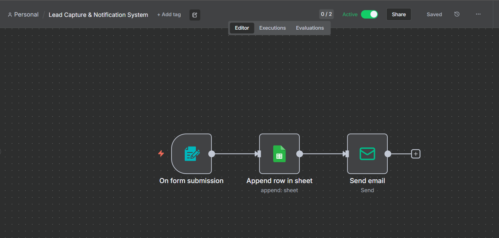

# Lead Capture and Notification System

## Overview

This workflow automatically captures lead information from a form, stores it in Google Sheets, and sends an instant email notification.

## Workflow

Form Trigger → Google Sheets → Email Notification

## Features

* Automated lead collection
* Google Sheets integration
* Instant email notifications
* No manual data entry required

## Tech Stack

* n8n
* Google Sheets
* SMTP Email
* Form Trigger

## Use Case

Businesses can automatically capture and manage leads without manually updating spreadsheets or checking forms.

## Workflow Screenshot

## Author

Samarth Singh
