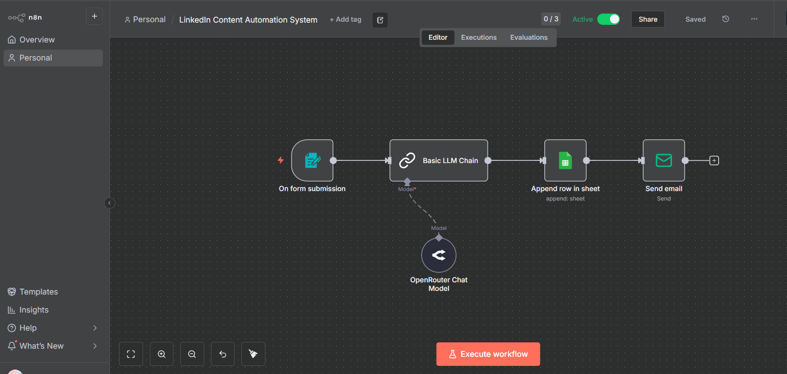

# LinkedIn Content Automation System

## Overview

This workflow automatically generates LinkedIn posts using AI based on a user-provided topic and content tone. The generated content is stored in Google Sheets and delivered via email for quick review and publishing.

## Workflow

Form Trigger → AI Content Generation → Google Sheets → Email Notification

## Features

* AI-powered LinkedIn post generation
* Multiple content tone options
* Professional, Educational, Storytelling, Motivational, and more
* Automatic storage in Google Sheets
* Instant email delivery
* User-friendly form interface

## Tech Stack

* n8n
* OpenRouter
* Google Gemma 4 31B
* Google Sheets
* SMTP Email

## How It Works

1. User submits a topic and selects a content tone.
2. AI generates a LinkedIn-ready post.
3. The generated content is automatically saved in Google Sheets.
4. A copy of the generated post is sent via email.

## Use Cases

* Personal branding
* LinkedIn content creation
* Social media management
* Content marketing
* Thought leadership publishing

## Workflow Screenshot

## Skills Demonstrated

* AI Automation
* Prompt Engineering
* Workflow Design
* Google Workspace Integration
* Email Automation
* Content Automation

## Author

Samarth Singh

AI Automation Builder | n8n | Digital Marketing | Meta Ads | WordPress
